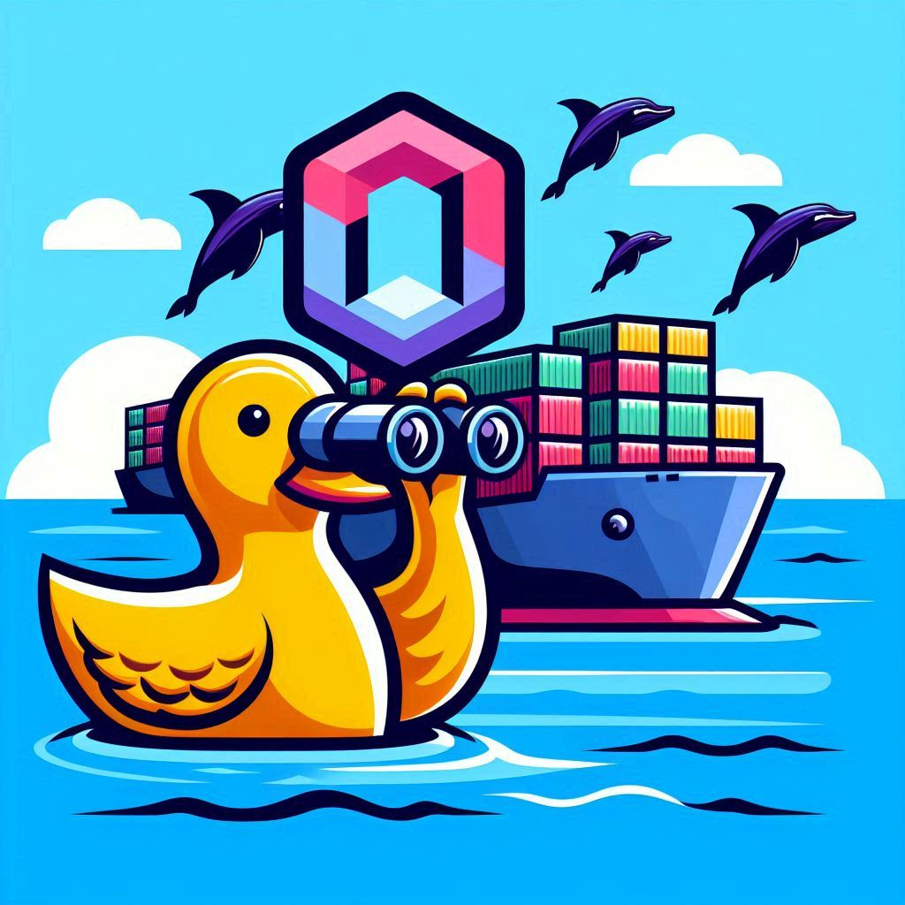

# DockWatch

**DockWatch** is a lightweight Python script that listens for Docker container events (start, stop, health status changes) for labelled containers.

It then sends webhook notifications including container metadata and recent logs.



*DockWatch logo created by Bing Image Creator AI service*

---

## Features

- Monitors Docker events: `container start`, `stop`, and health status `healthy` / `unhealthy`.
- Filters events to only watch containers labeled with `knom.dockWatch.watchHealth=true`.
- Sends detailed JSON payloads to a configurable webhook URL.
- Includes container start/stop timestamps and last 10 lines of container logs.
- Configurable logging with output to both console and log file.

---

## Requirements

- Docker daemon running locally (access to `/var/run/docker.sock`).
- Network access to your webhook endpoint.

---

## Installation

1. Clone this repository:

   ```bash
   git clone https://github.com/knom/dockwatch.git
   cd dockwatch
   ```

2. Build & run

    a) Via plain Docker

        ```bash
        docker build -t dockwatch .

        docker run -d \
        -v /var/run/docker.sock:/var/run/docker.sock \
        -e WEBHOOK_URL="https://your-webhook.url/endpoint" \
        -e LOGLEVEL="INFO" \
        --name dockwatch \
        dockwatch
        ```

    b) Via Docker Compose (compose file included in the repo)

        ```bash
        docker compose up -d
        ```
---

## Usage
Apply a label to your container to have **DockWatch** monitor it

a) in Docker Compose

```yaml
services:
    myservice:
        image: your-image
        labels:
            - "knom.dockWatch.watchHealth=true"
    # other settings...
```

b) in plain Docker

```bash
docker run -d \
    --label knom.dockWatch.watchHealth=true \
    your-image
```

## Webhook

When a Docker event is triggered on a labeled container **DockWatch** sends a POST request to the configured `WEBHOOK_URL`.

### Example Payload

```json
{
  "container_name": "my-container",
  "status": "healthy",
  "started_at": "2025-07-18T12:34:56.789Z",
  "finished_at": "0001-01-01T00:00:00Z",
  "logs": "Last 10 lines of container logs..."
}
